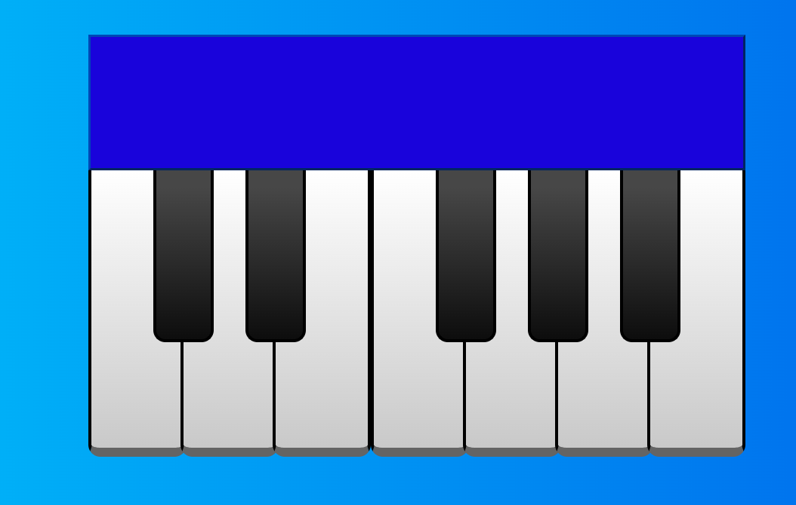

## Piano 🎹

Piano playing the first 12 notes. <br><br>


### 
```javascript
const notes = {
    do: '01-d0.mp3',
    dodiesis: '02-dodiesis.mp3',
    re: '03-re.mp3',
    rediesis: '04-rediesis.mp3',
    mi: '05-mi.mp3',
    fa: '06-fa.mp3',
    fadiesis: '07-fadiesis.mp3',
    sol: '08-sol.mp3',
    soldiesis: '09-soldiesis.mp3',
    la: '10-la.mp3',
    ladiesis: '11-ladiesis.mp3',
    si: '12-si.mp3'
}
```

```javascript
function playSound(key) {
    const audioElement = new Audio();
    const note = notes[key];
    audioElement.src = 'sounds/' + note;
    audioElement.play();
}
```

```javascript
keyElement.forEach(function(keyElement) {
    keyElement.addEventListener('touchend', function() {
        const key = keyElement.id;
        playSound(key);
    });
});
```
